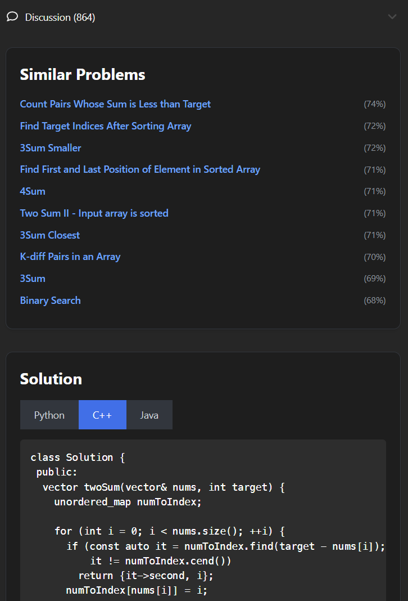

# Leetcode Enhancer

Chrome extension that enhances your LeetCode experience by displaying similar problems and solutions using solution embeddings.

## Installation

1. Clone or download this repository.
2. Open Google Chrome and go to `chrome://extensions/`.
3. Enable "Developer mode" using the toggle switch in the top right corner.
4. Click on "Load unpacked" and select the directory where you cloned/downloaded this repository.

## Usage

1. Navigate to any LeetCode problem (e.g., `https://leetcode.com/problems/two-sum/`).
2. The extension will automatically add a section below the "Discussion" section with similar problems and solutions.